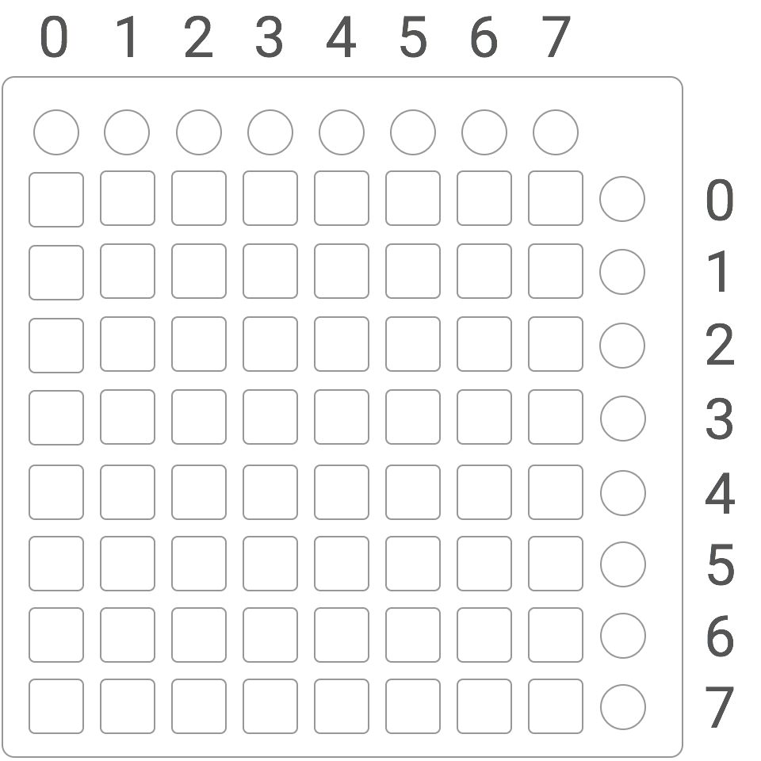

# Launchpad S Reader

> read input from Launchpad S MIDI controller

```shell
$ shell npm install --save launchpad-s-reader
```

## usage

```js
var LaunchpadSReader = require('launchpad-s-reader')
var launchpad = new LaunchpadSReader()

launchpad.on('press', function (e) {
  console.log('press', e)
})

launchpad.on('release', function (e) {
  console.log('release', e)
})

launchpad.on('error', function (e) {
  console.log('error', e)
})

launchpad.connect()
```

## buttons

when a `'press'` or `'release'` is fired, the `e` will look something like this

```js
{
  button: '',
  deltaTime: 1, // seconds since last press or release
  message: []   // raw midi values
}
```

the `button` values tell you which button was pressed. i used the labels on the launchpad, so they should be straight forward, but i'll break it down anyway



the round buttons across the top row are as follows

column | button
_______|________
0      | `up`
1      | `down`
2      | `left`
3      | `right`
4      | `session`
5      | `user1`
6      | `user2`
7      | `mixer`

the round buttons down the far right column are as follows

row    | button
_______|________
0      | `vol`
1      | `pan`
2      | `sndA`
3      | `sndB`
4      | `stop`
5      | `trkOn`
6      | `solo`
7      | `arm`

all the other buttons are called `'block'`s which will also come with `x` and `y` values corresponding to the column and row of that block
